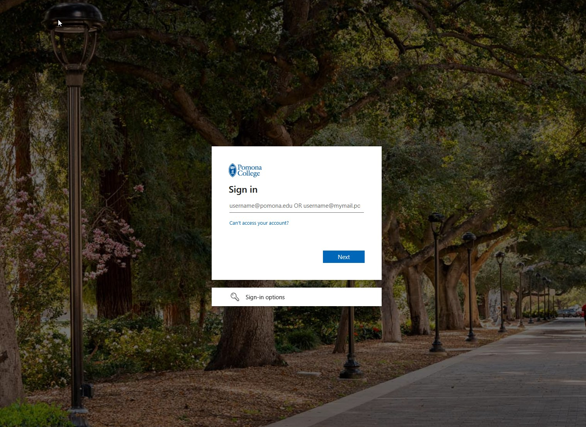
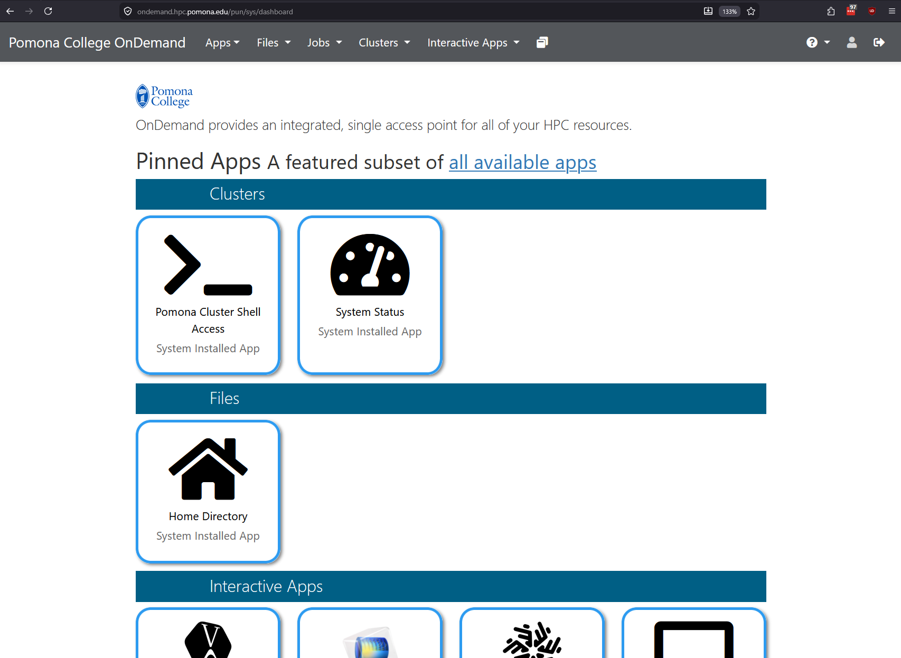

:::::::::::::::::::::::::::::::::::::: questions
- How do you log into OnDemand?
- What does the dashboard look like?
- How do you navigate between sections?
- Where can you find session and account information?
::::::::::::::::::::::::::::::::::::::::::::::::::

::::::::::::::::::::::::::::::::::::: objectives
- Log into OnDemand using Pomona credentials and DUO MFA
- Identify the main areas of the dashboard
- Navigate the top bar and side menu
- Manage sessions and log out properly
::::::::::::::::::::::::::::::::::::::::::::::::::

## Logging In

1. Open your browser and go to [https://ondemand.hpc.pomona.edu/](https://ondemand.hpc.pomona.edu/)
2. Enter your Pomona username and password
3. Complete DUO Multi-Factor Authentication at [https://duo.pomona.edu](https://duo.pomona.edu)
4. The dashboard loads with your available resources

After authentication, your session persists for several hours. Your browser maintains the connection, allowing seamless navigation between sections.

{alt='The Pomona College sign-in page shown on a photograph of campus. A dialogue box asks for username@pomona.edu or username@mymail.pomona.edu, with a Next button, a link for people who cannot access their account, and a sign-in options link.'}

## Dashboard Layout

### Top Navigation Bar

The top of every OnDemand page contains:

- **OnDemand Logo** (left): Click to return to the dashboard from any page
- **Menu Hamburger** (left): Opens/closes the main navigation sidebar
- **Help Links** (right): Access documentation and support
- **Account Menu** (far right): Your username with a dropdown for settings and logout

::::::::::::::::::::::::::::::::::::: callout
## Tip: Bookmark the Dashboard

Save [https://ondemand.hpc.pomona.edu/](https://ondemand.hpc.pomona.edu/) as a bookmark for quick access. You will return to this page frequently during your work sessions.
::::::::::::::::::::::::::::::::::::::::::::::::::

### Main Menu Structure

Click the hamburger menu to reveal the main navigation:

- **Files** -- Home Directory, bigdata, scratch, tmpfs
- **Jobs** -- Active Jobs, Job Composer, Cluster
- **Accounts** -- Usage, Profile
- **Interactive Apps** -- Jupyter Notebook, RStudio, Web Terminal
- **Clusters** -- Sagehen HPC Shell Access

{alt='The Pomona College OnDemand dashboard. A top menu bar offers Apps, Files, Jobs, Clusters and Interactive Apps. The page below shows pinned apps grouped under three headings: Clusters, containing Pomona Cluster Shell Access and System Status; Files, containing Home Directory; and Interactive Apps.'}

## Status Indicators

OnDemand uses color-coded status indicators throughout the interface:

- **Green**: Job is running, connection is active
- **Yellow/Orange**: Job is queued or pending
- **Red**: Error or job has failed
- **Gray**: Completed or closed session

## Session Management

- View active sessions in the "My Sessions" section
- Each session shows last access time and resource usage
- Sessions automatically expire after inactivity
- Check your Active Jobs regularly and close completed work to keep the dashboard clean

## Logging Out

1. Click your username (top right)
2. Select "Sign Out"
3. Always log out on shared or public computers

Contact its-hpc@pomona.edu if you have trouble logging in or accessing the dashboard.

::::::::::::::::::::::::::::::::::::: challenge

## Challenge: Navigate the Dashboard

Log into OnDemand and complete these tasks:
1. Access the Files section and navigate to your home directory
2. Click on "Active Jobs" to view any running jobs
3. Open the "Cluster" view to check current node status
4. Check your disk quota in the Accounts/Usage section
5. Locate the button to start a Jupyter notebook

Can you find each of these sections? Write down what you observe about the current state of the cluster.

:::::::::::::::::::::::::::::::: solution

1. **Files section**: Shows your files in `/rhome/<myusername>` with upload and download buttons
2. **Active Jobs**: Displays a table with columns for job ID, name, user, status, time, and nodes
3. **Cluster view**: Shows node status (idle, allocated, down) organized by partition
4. **Accounts/Usage**: Displays CPU usage, storage quota, and job history
5. **Interactive Apps**: A button or link to start Jupyter, RStudio, or Web Terminal

Common observations:
- Different users may see different available partitions
- Your quota depends on your research group allocation
- The cluster status changes throughout the day as jobs complete and start

:::::::::::::::::::::::::::::::::

::::::::::::::::::::::::::::::::::::::::::::::::::

::::::::::::::::::::::::::::::::::::: keypoints
- Log in at https://ondemand.hpc.pomona.edu/ with Pomona credentials and DUO MFA
- The top navigation bar has the logo, menu, help links, and account dropdown
- The side menu organizes access through Files, Jobs, Apps, and Clusters
- Color-coded indicators show job and resource status at a glance
- Always log out on shared computers to protect your account
::::::::::::::::::::::::::::::::::::::::::::::::::

<!-- highlight <labname>/<myusername> placeholders in code blocks; remove if the varnish theme handles this natively -->

