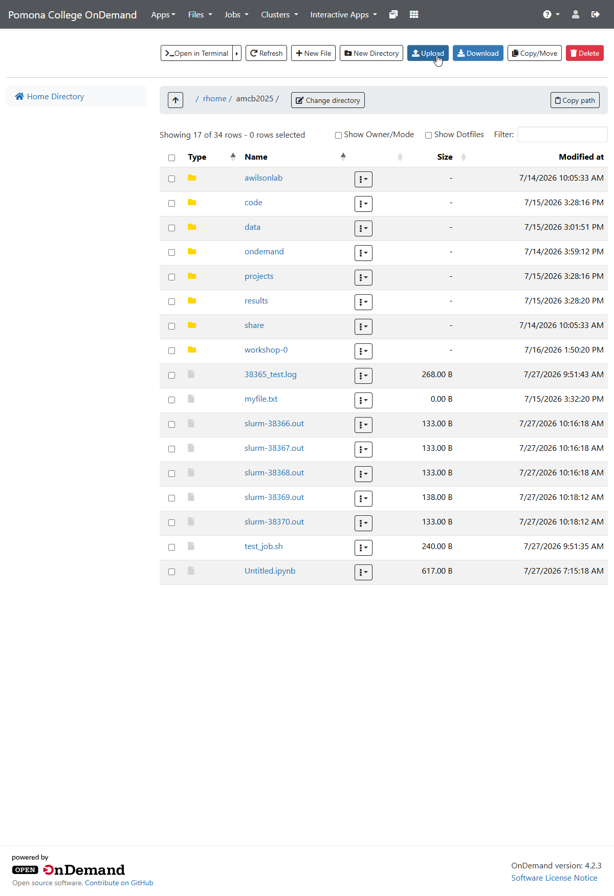
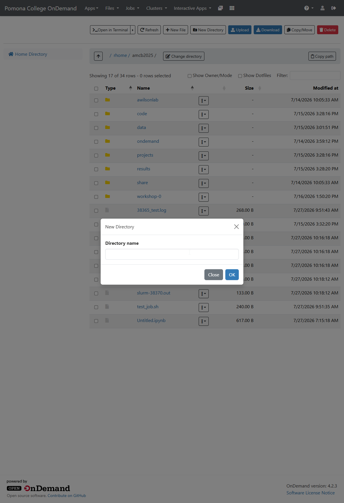
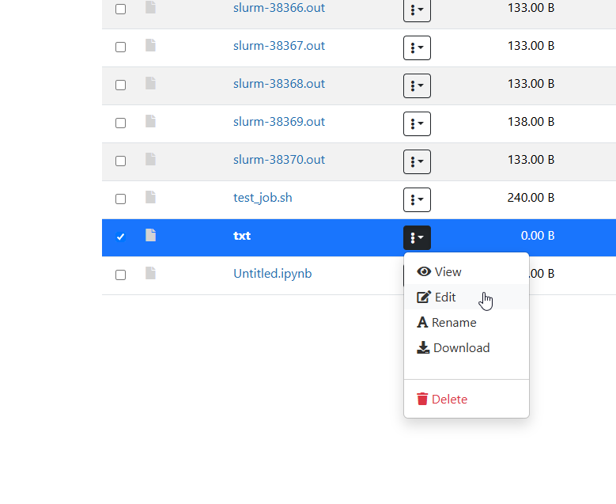

:::::::::::::::::::::::::::::::::::::: questions
- How do you upload files to Sagehen HPC through OnDemand?
- How do you download files back to your local computer?
- How do you create, rename, move, and delete files?
- Can you edit files directly in the browser?
::::::::::::::::::::::::::::::::::::::::::::::::::

::::::::::::::::::::::::::::::::::::: objectives
- Upload single and multiple files using the web interface
- Download files and directories from Sagehen
- Create directories and organize files
- Edit text files directly in OnDemand
- Manage file permissions through the browser
::::::::::::::::::::::::::::::::::::::::::::::::::

## OnDemand File Manager

The file manager provides a graphical interface for managing files on Sagehen without using SCP or SFTP. Access it through the **Files** menu in the left navigation.

## Uploading Files

### Single File Upload

1. Navigate to the desired directory in the file manager
2. Click the **Upload** button (up arrow icon)
3. Choose a file from your local computer
4. Click **Start Upload** and wait for the progress bar to complete

{alt='The Pomona College OnDemand Files app showing the home directory. A toolbar across the top offers Open in Terminal, Refresh, New File, New Directory, Upload, Download, Copy Move, and Delete. The listing includes folders such as code, data, and projects plus several slurm output files.'}

### Multiple File Upload

1. Click the **Upload** button
2. Select multiple files with Ctrl+Click (or Cmd+Click on Mac)
3. All files upload simultaneously with individual progress indicators

### Drag and Drop

1. Open the file manager in your browser
2. Drag files from your desktop or file explorer into the browser window
3. Files upload automatically -- faster than clicking buttons for batches

**Tips**: Upload large files to /bigdata, not /rhome (limited quota). Chrome and Firefox work best for uploads.

## Downloading Files

1. Open the file's dropdown menu (⋮) and select **Download**, or click the file and use the toolbar **Download** button
2. For multiple files, select them with checkboxes, then click **Download Selected** -- they arrive as a ZIP archive
3. Downloads go to your browser's default Downloads folder

## File Operations

### Creating Directories

1. Click **New Directory**
2. Enter a name (e.g., "analysis_2026")
3. Click **Create**

{alt='A modal dialog titled New Directory over the OnDemand file manager, containing a single Directory name input field and two buttons, Close and OK.'}

### Renaming

1. Open the file's dropdown menu (⋮) and select **Rename**
2. Enter the new name and press Enter

{alt='A cropped view of the OnDemand file listing with one file selected and its dropdown menu open, showing five actions: View, Edit, Rename, Download, and a red Delete option.'}

### Moving Files

1. Select the file(s), use the file's dropdown menu (⋮), and choose **Move** -- then navigate to the destination
2. Or use the file's dropdown menu (⋮) > **Cut**, navigate, then use the file's dropdown menu (⋮) > **Paste**

### Deleting

1. Open the dropdown menu (⋮) for the file or folder and select **Delete**
2. Confirm the deletion -- verify you have backups before deleting important data

## Inline Text Editing

OnDemand includes a built-in editor for text files (.txt, .sh, .py, .R, and similar):

1. Select a text file and click **Edit** (or double-click)
2. The editor opens in your browser with syntax highlighting
3. Make changes and click **Save**

For files larger than 10 MB, use a command-line editor in the Web Terminal instead.

## Managing Permissions

1. Use the file's dropdown menu (⋮) a file and select **Properties** or **Permissions**
2. View current permissions (e.g., `-rw-r--r--`)
3. Adjust read/write/execute for owner, group, and others

For executable scripts, ensure you mark them with execute permission.

## Storage Quotas

Check your usage in **Accounts > Usage** or run `quota_check.sh` in the Web Terminal. Monitor regularly to avoid hitting limits mid-project.

::::::::::::::::::::::::::::::::::::: callout
## Best Practice: Regular Cleanup

Check your storage quota monthly to avoid hitting limits mid-project. Remove old temporary files and archive completed work. If approaching quota limits, contact its-hpc@pomona.edu to request an increase rather than deleting valuable research data.
::::::::::::::::::::::::::::::::::::::::::::::::::

::::::::::::::::::::::::::::::::::::: challenge

## Challenge: Upload, Organize, and Download

1. Create a file on your local computer called "sample_data.txt" with some text
2. Log into OnDemand and upload this file to /bigdata
3. Create a new subdirectory called "project_2026"
4. Move sample_data.txt into project_2026
5. Download the file back to your computer to verify the transfer

Then check: How much storage are you currently using? Is your quota close to the 1 TB limit?

:::::::::::::::::::::::::::::::: solution

1. Your sample_data.txt uploads to /bigdata (typically `/bigdata/lab/<labname>`)
2. The new directory "project_2026" appears immediately
3. Moving the file into the subdirectory works via drag or cut/paste
4. Downloading returns the original file content intact
5. Run `quota_check.sh` in the Web Terminal to see your current usage

Common observations:
- Upload/download speeds depend on file size and your internet connection
- Creating directories is instant
- File operations in OnDemand are slower than command-line but more intuitive
- Your /rhome and /bigdata share the same 1 TB lab quota

:::::::::::::::::::::::::::::::::

::::::::::::::::::::::::::::::::::::::::::::::::::

::::::::::::::::::::::::::::::::::::: keypoints
- Upload files via drag-and-drop, single select, or multi-select
- Download single files directly or multiple files as a ZIP archive
- Create, rename, move, and delete files through the graphical interface
- Edit text files directly in the browser with syntax highlighting
- File permissions can be viewed and changed through the web interface
- Monitor your quota regularly with quota_check.sh or Accounts > Usage
::::::::::::::::::::::::::::::::::::::::::::::::::

<!-- highlight <labname>/<myusername> placeholders in code blocks; remove if the varnish theme handles this natively -->

