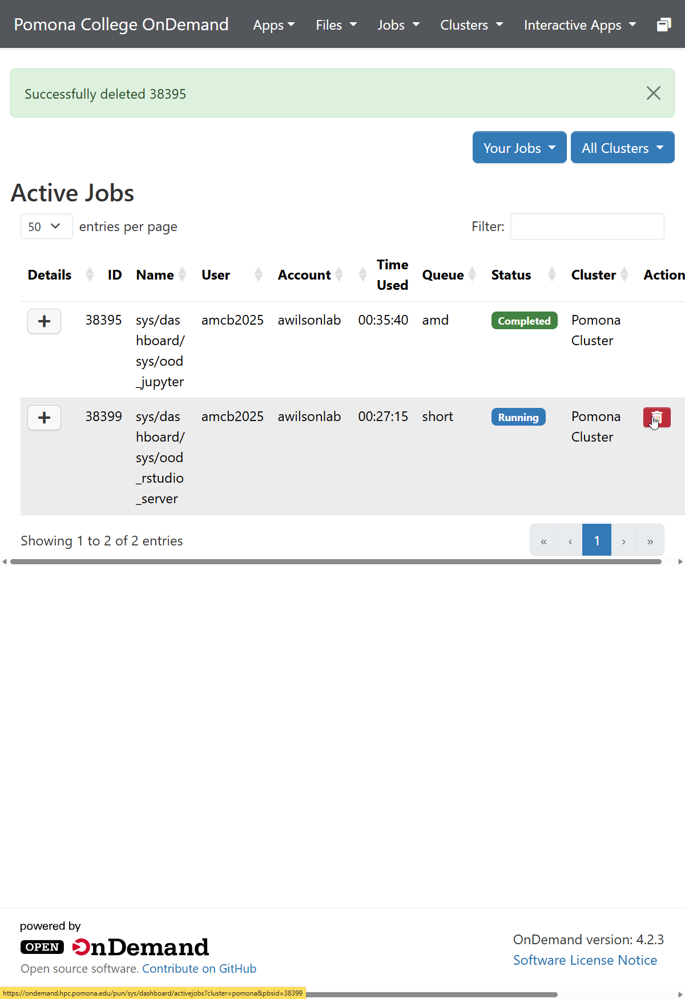

:::::::::::::::::::::::::::::::::::::: questions
- How do you monitor running jobs in OnDemand?
- Where do you find job output and error logs?
- How do you debug a failed job?
- What are typical queue wait times and job limits?
::::::::::::::::::::::::::::::::::::::::::::::::::

::::::::::::::::::::::::::::::::::::: objectives
- Use the Active Jobs view to monitor job status
- Retrieve and interpret output and error logs
- Debug common job failures using error messages
- Understand job limits, queue status, and scheduling basics
::::::::::::::::::::::::::::::::::::::::::::::::::

## Active Jobs View

Navigate to **Jobs** then **Active Jobs** to see all your jobs. Each entry shows:

- **Job ID**: Unique identifier assigned by SLURM
- **Name**: Job name from your script
- **Status**: Running (green), Pending (yellow), Completed (blue), Failed (red)
- **Time**: How long the job has been running
- **Nodes**: Which compute node(s) the job is using

## Job Details

Click on any job to see:

- Partition and node assignments
- Resource allocation (CPU cores, memory, GPUs)
- Time information (submission, start, estimated end)
- Links to output and error files

## Real-Time Monitoring

While a job is running:

1. Click on the job in Active Jobs
2. Click **View Output** or **View Error**
3. Refresh your browser to see the latest output
4. Useful for tracking progress and catching problems early

## Retrieving Output and Error Logs

After a job completes, OnDemand saves:

- **job.log** (or your `--output` filename): Standard output from your script
- **job.err** (or your `--error` filename): Error messages and warnings
- **Result files**: Any files your script created

Access these through the Active Jobs detail view or the Files section.

## Debugging Failed Jobs

When a job fails, check the error log for these common messages:

| Error Message | Cause | Fix |
|--------------|-------|-----|
| "module not found" | Module load failed | Check module name with `module avail` |
| "file not found" | Wrong input path | Use absolute paths like `/bigdata/lab/<labname>/file` |
| "out of memory" | Job needs more RAM | Increase `--mem` and resubmit |
| "timeout" / "time limit" | Job exceeded wall time | Increase `--time` (max 720 hours) |
| "permission denied" | Wrong file permissions | Check with `ls -l` and fix with `chmod` |

Fix the issue in your script, then resubmit through Job Composer.

## Canceling Jobs

1. Find the job in Active Jobs
2. Click the red **delete** (trash-can) button in the job's row
3. Confirm — a green "Successfully deleted <job id>" banner appears
4. The job stops immediately and resources are freed

You can also cancel from the Web Terminal with `scancel <job_id>`.

{alt='The Pomona College OnDemand Active Jobs page. A green banner reads Successfully deleted 38395. The table lists a completed Jupyter session on the amd queue and a running RStudio Server session on the short queue, and the mouse hovers over a red trash-can button used to cancel the running job.'}

## Job Constraints and Limits

Sagehen HPC enforces limits for fair resource sharing:

- **Time**: Max 720 hours (30 days) per job on `amd` and `gpu` partitions; the `short` partition has a shorter max walltime — check `sinfo -p short`
- **GPU limit**: GPU usage limits per user are configured in SLURM; check `sacctmgr show user $USER` or contact its-hpc@pomona.edu for current limits.
- **Queue position**: Based on submission time and fairness policies

## Queue Status and Scheduling

Check cluster status through **Jobs** then **Cluster**, or run `sinfo` in the Web Terminal. The view shows available nodes by partition, node status (idle, allocated, down), and current queue depth.

::::::::::::::::::::::::::::::::::::: callout
## Check Cluster Status

Before submitting large jobs, run `sinfo` in the Web Terminal or check **Jobs** > **Cluster** to see available resources. Submit during off-peak hours (evenings and weekends) for faster execution. Small jobs typically start faster than large ones.
::::::::::::::::::::::::::::::::::::::::::::::::::

### Typical Wait Times

- **amd partition**: Usually minutes to hours depending on cluster load
- **gpu partition**: May wait longer when GPUs are in high demand
- **short partition**: Typically the fastest to start because the scheduler can back-fill short jobs between longer ones
- **Off-peak hours**: Jobs typically start faster (evenings and weekends)
- **Smaller resource requests**: Generally queue for less time

## Scheduling Basics

1. Your job enters the queue when submitted
2. SLURM allocates resources based on job requirements, availability, and fairness
3. When resources become available, the job starts
4. The job completes and resources are freed for others

Priority depends on your recent usage history, number of running jobs, and time since your last job completed.

::::::::::::::::::::::::::::::::::::: challenge

## Challenge: Debug a Failed Job

A job submitted the following script but failed. Review the error log below and identify the problem:

```
#!/bin/bash
#SBATCH --job-name=analysis
#SBATCH --partition=amd
#SBATCH --time=00:10:00
#SBATCH --output=analysis.log
#SBATCH --error=analysis.err

module load miniconda3
cd /bigdata/lab/<labname>/project
python3 run_analysis.py --input data.csv --output results.csv
```

**Error log (analysis.err)**:
```
/var/spool/slurmd/job12345/slurm_script: line 9:
cd: /bigdata/lab/<labname>/project: No such file or directory
python3: can't open file '/bigdata/lab/<labname>/project/run_analysis.py':
[Errno 2] No such file or directory
```

What went wrong, and how would you fix it?

:::::::::::::::::::::::::::::::: solution

The error shows two problems caused by the same root issue:

1. **The directory `/bigdata/lab/<labname>/project` does not exist.** Either the lab name is wrong or the directory was never created.
2. **The Python script cannot be found** because the `cd` failed and the script is not at the default path.

To fix:
- Verify the correct lab directory name (check in OnDemand Files > bigdata)
- Create the directory if it does not exist: `mkdir -p /bigdata/lab/<labname>/project`
- Confirm the script `run_analysis.py` and `data.csv` are in that directory
- Resubmit the job after fixing the path

Always use `ls` to verify paths before submitting jobs.

:::::::::::::::::::::::::::::::::

::::::::::::::::::::::::::::::::::::::::::::::::::

::::::::::::::::::::::::::::::::::::: keypoints
- Active Jobs shows real-time status with color-coded indicators
- Click any job to see details, output logs, and error logs
- Common failures include wrong paths, missing modules, and insufficient resources
- Cancel jobs from Active Jobs or with scancel in the terminal
- Sagehen offers three partitions: `amd` and `gpu` (each up to 720 hours / 30 days) and `short` (shorter max walltime, good for quick test/debug jobs — check `sinfo -p short`)
- Check cluster status before submitting and prefer off-peak hours for faster starts
::::::::::::::::::::::::::::::::::::::::::::::::::

<!-- highlight <labname>/<myusername> placeholders in code blocks; remove if the varnish theme handles this natively -->
<script>(function(){var CSS='.sh-placeholder{color:#c2410c;font-weight:700}[data-bs-theme="dark"] .sh-placeholder,html.dark .sh-placeholder{color:#fdba74}@media (prefers-color-scheme: dark){[data-bs-theme="auto"] .sh-placeholder{color:#fdba74}}';var RX=/<labname>|<myusername>/g;function firstMatch(el){var w=document.createTreeWalker(el,NodeFilter.SHOW_TEXT,null),nodes=[],full='';while(w.nextNode()){nodes.push({n:w.currentNode,s:full.length});full+=w.currentNode.nodeValue;}RX.lastIndex=0;var m;while((m=RX.exec(full))){var s=m.index,e=s+m[0].length,inSpan=false,parts=[];for(var j=0;j<nodes.length;j++){var ns=nodes[j].s,ne=ns+nodes[j].n.nodeValue.length;if(ne<=s||ns>=e)continue;parts.push({node:nodes[j].n,a:Math.max(s-ns,0),b:Math.min(e-ns,nodes[j].n.nodeValue.length)});var p=nodes[j].n.parentNode;while(p&&p!==el){if(p.classList&&p.classList.contains('sh-placeholder')){inSpan=true;break;}p=p.parentNode;}}if(!inSpan&&parts.length)return parts;}return null;}function wrapParts(parts){for(var i=parts.length-1;i>=0;i--){var t=parts[i].node,txt=t.nodeValue,a=parts[i].a,b=parts[i].b;var span=document.createElement('span');span.className='sh-placeholder';span.textContent=txt.slice(a,b);var f=document.createDocumentFragment();if(a>0)f.appendChild(document.createTextNode(txt.slice(0,a)));f.appendChild(span);if(b<txt.length)f.appendChild(document.createTextNode(txt.slice(b)));t.parentNode.replaceChild(f,t);}}function run(){var st=document.createElement('style');st.textContent=CSS;document.head.appendChild(st);document.querySelectorAll('pre,code').forEach(function(el){var guard=0,parts;while((parts=firstMatch(el))&&guard++<500){wrapParts(parts);}});}if(document.readyState==='loading'){document.addEventListener('DOMContentLoaded',run);}else{run();}})();</script>
